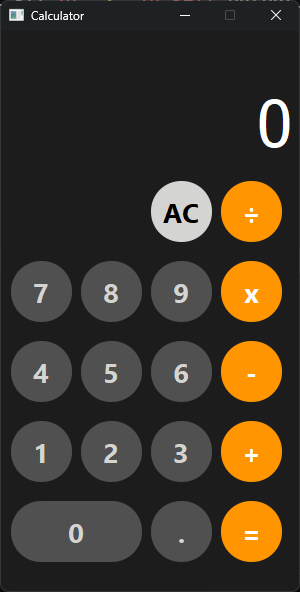
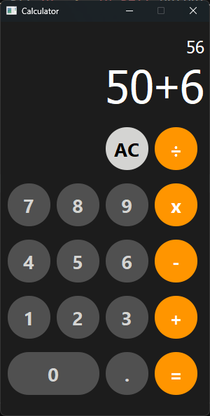

# 💫PyQt6 Calculator

This is a simple calculator application built using PyQt6. It supports basic arithmetic operations such as addition, subtraction, multiplication, and division. The calculator also includes real-time result updates and error handling for invalid inputs.

## 👩🏻‍💻Features

- Basic arithmetic operations: Addition (+), Subtraction (-), Multiplication (x), and Division (÷).
- Input of decimal numbers using ' . '
- Clear all input with the "Delete All" button.
- Real-time display of results as you input numbers.

## 📝Installation

1. Ensure you have Python installed on your system (Python 3.6 or higher).

   a. `Download Python:`

   - Go to the [official Python website](https://www.python.org/downloads/).
   - Download the latest version suitable for your operating system (Windows, macOS, or Linux).

   b. `Run the Installer:`

   - For Windows, run the downloaded installer.
   - Ensure you check the box that says "Add Python to PATH" before clicking "Install Now."

   c. `Verify Installation:`

   - Open a command prompt (Windows) or terminal (macOS/Linux).
   - Type the following command and press Enter:
     ```bash
     python --version
     ```
   - Alternatively, you can use:
     ```bash
     python3 --version
     ```

2. Install the required PyQt6 packages using pip:

   a. `Open Command Prompt or Terminal:`

   - On Windows, search for "cmd" and open the Command Prompt.
   - On macOS/Linux, open the Terminal.

   b. `Install PyQt6 using pip:`

   - Run the following command:
     ```bash
     pip install PyQt6
     ```

   c. `Verify Installation:`

   - Start a Python shell:
     ```bash
     python
     ```
   - Try to import PyQt6:
     ```python
     import PyQt6
     print(PyQt6.__version__)
     ```

# 💻 Tech Stack:

 

## 🌐Sample

 
